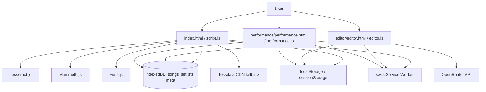
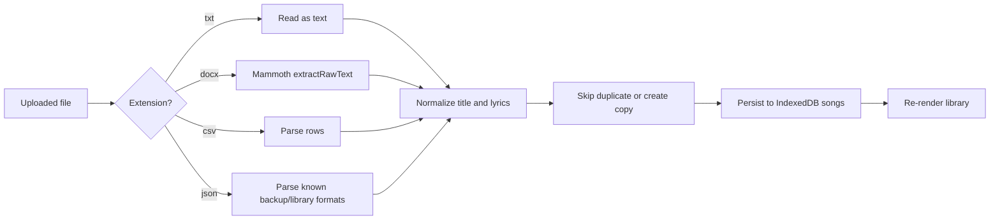
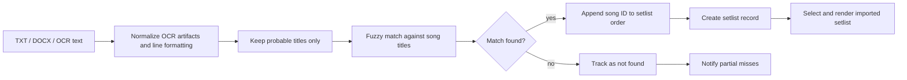

# SongBinder

SongBinder is a local-first progressive web application for musicians who need an offline-capable song library, setlist builder, and live-performance lyric viewer. The application is delivered as a static front-end with no bundled server runtime: all primary business data is stored in the browser, while optional AI and OCR features call external services or libraries from the client. The codebase includes three coordinated application surfaces:

1. **Main library application** for song, setlist, import, export, and launch workflows.
2. **Full-screen performance application** for live playback, autoscroll, and stage navigation.
3. **Dedicated editor application** for structured lyric authoring, chords, metadata, and AI-assisted editing.

## Local Auth Setup

Supabase Auth is optional and currently limited to sign-in state plus explicit user-triggered flows. The app remains local-first: songs and setlists still live in IndexedDB, and there is no full sync implementation yet.

1. Copy `.env.example` to `.env` or `.env.local`.
2. Set `SUPABASE_URL` and `SUPABASE_ANON_KEY`.
3. Run `npm run env:write` to generate `env.js`.
4. Serve the project and use the landing screen to either sign in with Google or continue offline.

`env.js` is gitignored and must be generated locally for auth-enabled runs.

---

## 1. System Architecture

### 1.1 Architectural Summary

| Layer                   | Implementation                                              | Responsibilities                                                                             |
| ----------------------- | ----------------------------------------------------------- | -------------------------------------------------------------------------------------------- |
| Frontend shell          | Static HTML + vanilla JavaScript + CSS                      | Renders the library UI, performance mode, and editor without a build step.                   |
| Persistence             | IndexedDB via `idb`, plus `localStorage` / `sessionStorage` | Stores songs, setlists, migration flags, user preferences, performance state, and reminders. |
| Search and matching     | Fuse.js                                                     | Fuzzy search across titles and lyrics; fuzzy setlist matching during text/OCR import.        |
| Document parsing        | Mammoth.js                                                  | Extracts plain text from imported `.docx` files.                                             |
| OCR                     | Tesseract.js + local language files / CDN fallback          | Reads setlist images and converts them into song-title candidates.                           |
| Reordering              | SortableJS                                                  | Enables drag-and-drop ordering inside setlists.                                              |
| Optional AI integration | OpenRouter HTTP API                                         | Powers editor-side lyric generation, rewriting, chord suggestions, and formatting.           |
| Offline delivery        | Service worker + Web App Manifest                           | Caches application shells and assets for PWA-like offline use.                               |

### 1.2 High-Level Topology



### 1.3 Runtime Surfaces

#### Main Application

- Entry point: `index.html`.
- Controller: `script.js`.
- Responsibilities:
  - songs library CRUD,
  - setlist CRUD and ordering,
  - import/export workflows,
  - OCR-based setlist ingestion,
  - search, sorting, favorites,
  - launch into editor or performance mode.

#### Editor Application

- Entry point: `editor/editor.html`.
- Controllers: `editor/editor.js`, `editor/db.js`, `editor/songs.js`.
- Responsibilities:
  - advanced song editing,
  - chord/lyric lane management,
  - metadata editing,
  - undo/redo,
  - AI operations,
  - voice dictation,
  - song-specific formatting and export.

#### Performance Application

- Entry point: `performance/performance.html`.
- Controller: `performance/performance.js`.
- Responsibilities:
  - large-format lyric rendering,
  - next/previous navigation,
  - section jumping,
  - per-song font and autoscroll preferences,
  - theme switching,
  - resume prompts and exit-state persistence.

### 1.4 Storage Architecture

#### IndexedDB Schema

SongBinder uses a single IndexedDB database named `hrr-setlist-db` with schema version `2`.

| Object store | Key path  | Purpose                                                        |
| ------------ | --------- | -------------------------------------------------------------- |
| `songs`      | `id`      | Canonical song records used by all three application surfaces. |
| `setlists`   | `id`      | Ordered song references grouped by performance setlist.        |
| `meta`       | key-value | Migration flags and database health metadata.                  |

#### Song Record Shape

| Field                        | Type               | Source            | Notes                                                                       |
| ---------------------------- | ------------------ | ----------------- | --------------------------------------------------------------------------- |
| `id`                         | string             | main app / editor | Primary identifier.                                                         |
| `title`                      | string             | main app / editor | Normalized title; duplicates are constrained by workflow logic, not schema. |
| `lyrics`                     | string             | main app / editor | Normalized block text with title stripping and whitespace cleanup.          |
| `favorite`                   | boolean            | main app          | Optional flag for library filtering.                                        |
| `createdAt`                  | ISO string / epoch | main app / editor | Creation timestamp if available.                                            |
| `lastEditedAt` / `updatedAt` | ISO string / epoch | main app / editor | Used for sorting and change tracking.                                       |
| `chords`                     | string             | editor            | Optional chord lane text.                                                   |
| `key`                        | string             | editor            | Musical key metadata.                                                       |
| `tempo`                      | number             | editor            | BPM metadata.                                                               |
| `timeSignature`              | string             | editor            | Rhythmic metadata.                                                          |
| `notes`                      | string             | editor            | Performance/composition notes.                                              |
| `tags`                       | string[]           | editor            | Arbitrary song labels.                                                      |

#### Setlist Record Shape

| Field       | Type     | Notes                                               |
| ----------- | -------- | --------------------------------------------------- |
| `id`        | string   | Primary identifier.                                 |
| `name`      | string   | Normalized and de-duplicated setlist title.         |
| `songs`     | string[] | Ordered song IDs.                                   |
| `createdAt` | number   | Epoch milliseconds.                                 |
| `updatedAt` | number   | Updated on rename, reorder, add, remove, or import. |

### 1.5 External Integrations

| Integration                         | Type                    | Trigger                                  | Failure behavior                                                       |
| ----------------------------------- | ----------------------- | ---------------------------------------- | ---------------------------------------------------------------------- |
| OpenRouter                          | HTTPS API               | Editor AI tools and model list discovery | Editor surfaces warnings if API key is missing or requests fail.       |
| Tesseract local assets              | Local web worker + WASM | OCR setlist import                       | Falls back to tessdata CDN if local language asset headers are unsafe. |
| Tessdata CDN                        | HTTPS asset delivery    | OCR fallback path                        | OCR still fails gracefully if unavailable.                             |
| Web Speech API                      | Browser API             | Search voice input and editor dictation  | Buttons hide or no-op if browser support is unavailable.               |
| Screen Wake Lock / Orientation Lock | Browser API             | Performance mode initialization          | Best-effort only; app remains usable if unsupported.                   |

---

## 2. Feature Inventory

### 2.1 User-Facing Features

#### Songs Library

- Add a song manually from the quick-add modal.
- Open a full-screen editor for a song.
- Upload songs from `.txt`, `.docx`, `.json`, and `.csv` files.
- Search songs across both title and lyric content.
- Trigger voice search if `SpeechRecognition` is available.
- Clear active search queries with dedicated clear buttons.
- Filter library to favorites only.
- Sort songs alphabetically ascending/descending and by edited date ascending/descending.
- Long-press a song card on touch devices to copy title plus lyrics.
- Toggle song favorite state.
- Delete individual songs with cascade updates to any affected setlists.
- Undo a delete through action toasts.
- Delete all songs from the toolbar.
- Open empty-state shortcuts to create or upload the first song.

#### Setlist Management

- Create, rename, duplicate, and delete setlists.
- Add songs into a selected setlist from an available-song column.
- Remove songs from a setlist.
- Reorder setlist songs with drag-and-drop.
- Reorder setlist songs with explicit move up/down controls.
- Import setlists from plain text or `.docx` title lists using fuzzy title matching.
- Import setlists from OCR-extracted images.
- Export current setlist or all setlists as JSON, text lists, text with lyrics, or PDF.

#### Performance / Lyrics View

- Select either a specific setlist or the full song library.
- Filter songs within the performance launcher.
- Start performance from the first item in the current selection.
- Start performance from an individual song card.
- Render lyrics in a dedicated full-screen surface.
- Navigate by touch swipe, tap zones, or keyboard.
- Resume a previously played setlist position.
- Display progress index `(current / total)`.
- Toggle dark/light theme.
- Adjust font size per song and persist those values.
- Enable or pause autoscroll with configurable delay and speed.
- Persist per-song autoscroll speeds and auto-start preference.
- Show or hide chord lines during performance.
- Provide optional haptic/audio tap feedback.
- Jump to detected section labels such as chorus and verse.
- Save last position on exit and return to the main app.

#### Full Editor

- Open a dedicated editing surface per song.
- Work in lyrics-only, chords-only, or combined edit modes.
- Toggle read-only “performance mode” inside the editor.
- Add section labels and rename or delete them.
- Manage metadata: key, tempo, time signature, notes, and tags.
- Use undo/redo stacks.
- Copy raw lyrics, lyrics with chords, formatted markdown, metadata only, or download text.
- Toggle rhyme-color and measure visualization modes.
- Use voice dictation with navigation commands such as next line / previous line.
- Fetch AI suggestions, review them, and accept or reject the result.
- Configure and persist OpenRouter API credentials and preferred model.

### 2.2 Background and Platform Services

- IndexedDB migration from legacy `localStorage` song and setlist blobs.
- Legacy data backup to `legacy_backup_*` keys when malformed JSON is encountered.
- Service-worker registration with update banner and skip-waiting flow.
- Persistent storage requests via `navigator.storage.persist()`.
- Offline caching for the main app, editor, performance shell, fonts, icons, and local libraries.
- Database self-repair if required object stores are missing.
- Backup reminders driven by elapsed time since the last full export.
- Safe parsing and normalization of imported content.
- Fuzzy match indexing for search and OCR setlist import.
- Wake lock and landscape lock requests during performance mode.
- Popstate interception during performance mode to prevent accidental exit.

---

## 3. Functional Specifications

### 3.1 Navigation Model

| Route / file                                                        | Purpose                    | Key inputs                                                                            |
| ------------------------------------------------------------------- | -------------------------- | ------------------------------------------------------------------------------------- |
| `index.html`                                                        | Main application shell     | none                                                                                  |
| `editor/editor.html?songId=<id>`                                    | Editor for a specific song | `songId` query parameter                                                              |
| `performance/performance.html?songId=<id>&setlistId=<id>&ids=<csv>` | Performance mode           | `songId` required for explicit launch; `setlistId` and `ids` optimize context loading |

### 3.2 Application State Domains

#### IndexedDB-backed state

- Songs collection.
- Setlists collection.
- Migration metadata.

#### `localStorage` state

| Key                                                                  | Purpose                                                |
| -------------------------------------------------------------------- | ------------------------------------------------------ |
| `theme`                                                              | Shared dark/light theme across app surfaces.           |
| `songSortMode`                                                       | Main library sort order.                               |
| `songsFavoritesOnly`                                                 | Favorites-only filter state.                           |
| `lastActiveTab`                                                      | Last selected main tab.                                |
| `lastActiveSetlistId`                                                | Last active setlist in setlist/performance workflows.  |
| `lastPerformance`                                                    | Last performance setlist and song index.               |
| `autoscrollSpeed`, `autoscrollDelay`                                 | Global autoscroll defaults.                            |
| `perSongAutoscrollSpeeds`                                            | Song-specific autoscroll speeds.                       |
| `autoScrollOnStart`                                                  | Song-specific auto-start flags.                        |
| `perSongFontSizes`                                                   | Song-specific lyric font sizes.                        |
| `performanceShowChords`                                              | Global chord visibility in performance mode.           |
| `tapFeedbackMode`                                                    | Tap audio/haptic behavior in performance mode.         |
| `backupReminderEnabled`, `backupReminderDays`, `lastExportAt`        | Backup reminder system.                                |
| `editorMode`                                                         | Editor display mode.                                   |
| `measureMode_<songId>`                                               | Per-song editor measure mode.                          |
| `undoStack_<songId>`                                                 | Persisted editor undo history.                         |
| `openrouterApiKey`, `openrouterModel`                                | Optional AI credentials/configuration.                 |
| `dictationHintShown`, `openrouterKeyWarningShown`, `chordsHintShown` | One-time instructional hints.                          |
| `devMode`                                                            | Enables `window.CONFIG.devMode` in local environments. |

#### `sessionStorage` state

| Key                     | Purpose                                         |
| ----------------------- | ----------------------------------------------- |
| `songsLoadedToastShown` | Prevents duplicate initial-load toasts.         |
| `backupReminderShown`   | Prevents duplicate reminder toasts per session. |
| `dbResetToastShown`     | Prevents repeated database-reset notices.       |
| `lastSongId`            | Editor continuity when returning to a song.     |

### 3.3 Main Data Flows

#### Song Import Flow



#### Setlist Import Flow



#### Performance Launch Flow

1. User chooses a setlist or “All Songs”.
2. User optionally filters the launcher list.
3. User starts from the first song or from a specific card.
4. Main app builds query parameters:
   - `songId` = explicit starting song,
   - `setlistId` = current or inferred setlist,
   - `ids` = comma-separated ordered setlist IDs for `file://` and offline fallback.
5. Performance page loads songs from IndexedDB and reconstructs the ordered play queue.
6. If the same setlist was previously in progress, the app may prompt to resume.

### 3.4 API and Integration Specifications

#### Internal HTTP API

There is **no first-party backend API** in this repository. All application logic executes client-side.

#### External API: OpenRouter

| Property        | Value                                                                                            |
| --------------- | ------------------------------------------------------------------------------------------------ |
| Endpoint        | `POST https://openrouter.ai/api/v1/chat/completions`                                             |
| Purpose         | Text generation and lyric/chord assistance in the editor.                                        |
| Auth            | `Authorization: Bearer <openrouterApiKey>`                                                       |
| Model selection | `window.CONFIG.defaultModel` or user-selected `openrouterModel`, defaulting to `openrouter/auto` |

Example payload shape:

```json
{
  "model": "openrouter/auto",
  "messages": [
    {
      "role": "user",
      "content": "Rewrite this chorus in a darker tone..."
    }
  ]
}
```

Additional model discovery call:

| Endpoint                              | Method | Purpose                                        |
| ------------------------------------- | ------ | ---------------------------------------------- |
| `https://openrouter.ai/api/v1/models` | `GET`  | Populate selectable model list in AI settings. |

#### OCR Dependency Path

| Asset / endpoint                            | Role                        |
| ------------------------------------------- | --------------------------- |
| `lib/tesseract/worker.min.js`               | OCR worker entrypoint       |
| `lib/tesseract/tesseract-core-simd.wasm.js` | OCR core bootstrap          |
| `lib/tesseract/eng.traineddata.gz`          | Local English language data |
| `https://tessdata.projectnaptha.com/4.0.0`  | Fallback language-data host |

### 3.5 Import / Export Specifications

#### Song import formats

| Format  | Expected structure                                          | Notes                                |
| ------- | ----------------------------------------------------------- | ------------------------------------ |
| `.txt`  | One song per file                                           | Title inferred from filename.        |
| `.docx` | Text document                                               | Lyrics extracted with Mammoth.       |
| `.csv`  | Header row with `Title,Lyrics`                              | Additional rows become songs.        |
| `.json` | Array of songs, `{ songs: [...] }`, or backup-like variants | Supports library and backup imports. |

#### Setlist import formats

| Format  | Expected structure                             | Notes                                     |
| ------- | ---------------------------------------------- | ----------------------------------------- |
| `.txt`  | One probable title per line                    | Fuzzy matched against existing library.   |
| `.docx` | Text lines                                     | Same matching pipeline as `.txt`.         |
| image   | OCR text                                       | Uses Tesseract, then fuzzy matches.       |
| `.json` | `{ setlist, songs }` or array of those objects | Can merge songs before creating setlists. |

#### Export matrix

| Scope           | Formats                                                                                  |
| --------------- | ---------------------------------------------------------------------------------------- |
| Songs only      | JSON array, JSON library format, CSV, TXT (single file), TXT (separate files / ZIP), PDF |
| Current setlist | JSON, TXT track list, TXT track list + lyrics, PDF                                       |
| All setlists    | JSON, TXT track list, TXT track list + lyrics, PDF                                       |
| Everything      | JSON backup (songs + setlists), songs-only JSON                                          |

### 3.6 Security and Content Handling

- Content Security Policy is declared directly in each HTML document.
- User-generated text is escaped before being inserted into HTML fragments.
- Local OCR language assets are header-checked before use to avoid serving compressed trained data incorrectly.
- AI keys are stored locally in the browser; there is no server-side secret store.
- Because the app is local-first, clearing browser storage removes application data unless exported first.

---

## 4. Installation and Deployment

### 4.1 Prerequisites

| Tool                          | Minimum use                                                           |
| ----------------------------- | --------------------------------------------------------------------- |
| Modern desktop/mobile browser | Run the application                                                   |
| Node.js + npm                 | Optional linting, formatting, and local static serving                |
| HTTPS or `http://localhost`   | Required for best service-worker, clipboard, speech, and PWA behavior |

### 4.2 Local Development Setup

1. Clone the repository.
2. Install development dependencies.
3. Serve the repository as a static site.
4. Open the app in a browser.

```bash
git clone <your-fork-or-repo-url>
cd SongBinder
npm install
npx serve .
```

Then open the printed local URL, typically:

```text
http://localhost:3000
```

### 4.3 NPM Scripts

| Command          | Purpose                                                                           |
| ---------------- | --------------------------------------------------------------------------------- |
| `npm run lint`   | Run ESLint across project JavaScript files while ignoring vendored `lib/` assets. |
| `npm run format` | Apply Prettier to JS, CSS, HTML, JSON, and Markdown files.                        |
| `npm test`       | Placeholder script; currently prints `No tests yet`.                              |

### 4.4 Configuration Surface

Runtime defaults live in `config.js` and are assigned to `window.CONFIG`.

| Key                           | Purpose                                | Default                                               |
| ----------------------------- | -------------------------------------- | ----------------------------------------------------- |
| `chordsModeEnabled`           | Enables chord-related editor features  | `true`                                                |
| `autosaveEnabled`             | Enables editor autosave behavior       | `true`                                                |
| `autoscrollDefaultEnabled`    | Controls default autoscroll capability | `true`                                                |
| `showExperimentalFeatures`    | Feature-flag placeholder               | `false`                                               |
| `maxFontSize` / `minFontSize` | Editor/performance font bounds         | `64` / `16`                                           |
| `devMode`                     | Development diagnostics toggle         | `false` unless `localhost` + `localStorage.devMode=1` |
| `openrouterApiKey`            | Optional AI key                        | empty string                                          |
| `defaultModel`                | Preferred AI model                     | empty string                                          |
| `chordLinePrefix`             | Chord-line parsing heuristic           | `~`                                                   |
| `assumeNoChords`              | Chord parsing default                  | `true`                                                |

Example local configuration override:

```js
window.CONFIG = {
  chordsModeEnabled: true,
  autosaveEnabled: true,
  autoscrollDefaultEnabled: true,
  showExperimentalFeatures: false,
  maxFontSize: 64,
  minFontSize: 16,
  devMode: false,
  openrouterApiKey: '',
  defaultModel: '',
  chordLinePrefix: '~',
  assumeNoChords: true,
};
```

### 4.5 Environment Variables

This repository does **not** use a server-side `.env` contract. Optional AI credentials are entered in the editor UI and stored in browser `localStorage`.

If you want environment-driven configuration for hosted deployments, you must add your own build or server injection layer; it is not present in the current codebase.

### 4.6 Production Deployment

Because the project is static, production hosting can be handled by any web server or static host.

#### Requirements

- Serve the repository root as static files.
- Preserve the directory structure for `editor/`, `performance/`, `lib/`, and `assets/`.
- Serve with HTTPS for best browser API support.
- Ensure `eng.traineddata.gz` is **not** sent with `Content-Encoding: gzip`; it should be served as a binary file, ideally with `application/octet-stream`.

#### Example: Nginx static hosting

```nginx
server {
    listen 443 ssl;
    server_name songbinder.example.com;

    root /var/www/songbinder;
    index index.html;

    location / {
        try_files $uri $uri/ /index.html;
    }

    location /lib/tesseract/eng.traineddata.gz {
        types { application/octet-stream gz; }
        default_type application/octet-stream;
        gzip off;
        add_header Cache-Control "public, max-age=31536000, immutable";
    }
}
```

### 4.7 Offline / PWA Considerations

- The service worker precaches the main shell, performance shell, editor shell, icons, fonts, and local JS/CSS assets.
- HTML navigations are resolved to cached shell files during offline use.
- `file://` launches may still work, but service workers do not run in that mode; the application compensates by passing ordered `ids` into performance mode.
- If the application shell changes, users may need to accept the “Update available” banner or hard-refresh.

---

## 5. Contribution Guidelines

### 5.1 Development Standards

- Preserve the no-build-step architecture unless a deliberate platform change is approved.
- Keep primary functionality available without a backend dependency.
- Favor progressive enhancement for browser APIs such as speech recognition, wake lock, and clipboard access.
- Avoid introducing inline scripts that would weaken the existing CSP model.
- Maintain local-first data ownership and never silently move user data off-device.

### 5.2 Recommended Workflow

```bash
git checkout -b docs/<short-description>
npm install
npm run lint
npm run format
```

### 5.3 Validation Checklist for Pull Requests

- Verify the main app opens and navigates between Songs, Setlists, and Lyrics tabs.
- Verify editor launch and save round-trips to IndexedDB.
- Verify performance mode launches and returns cleanly.
- Verify at least one import and one export workflow when modifying those areas.
- Verify service worker registration still succeeds on a static server.

### 5.4 Pull Request Expectations

Include the following in each PR:

- concise problem statement,
- summary of functional changes,
- user impact and risk areas,
- manual verification steps,
- screenshots for visual changes,
- migration or storage compatibility notes if persistence changes.

---

## 6. Troubleshooting for Developers and Operators

| Symptom                                   | Likely cause                                                      | Resolution                                                                                      |
| ----------------------------------------- | ----------------------------------------------------------------- | ----------------------------------------------------------------------------------------------- |
| OCR import fails immediately              | Tesseract assets missing or headers incorrect                     | Confirm `lib/tesseract/*` is being served and that `eng.traineddata.gz` is not content-encoded. |
| Service worker does not update            | Cached older shell still controlling clients                      | Use the in-app update banner, unregister in DevTools, or hard refresh.                          |
| PDF export opens nothing                  | Browser blocked `window.open()`                                   | Allow pop-ups for the app origin.                                                               |
| Voice search/dictation buttons do nothing | Browser lacks Web Speech API or microphone permission             | Test in a compatible browser and grant microphone access.                                       |
| AI tools return errors                    | Missing or invalid OpenRouter key/model                           | Re-enter key in editor settings and validate outbound network access.                           |
| Performance page loads without songs      | IndexedDB unavailable in current context or `file://` constraints | Launch from the main app so `songId`, `setlistId`, and `ids` are passed together.               |
| User data disappears                      | Browser storage cleared or quota eviction                         | Encourage periodic full JSON export and persistent-storage approval.                            |

---

## 7. Repository Map

| Path                           | Role                                                  |
| ------------------------------ | ----------------------------------------------------- |
| `index.html`                   | Main application shell                                |
| `script.js`                    | Main application controller                           |
| `style.css`                    | Shared application styling                            |
| `config.js`                    | Runtime defaults and editor/performance feature flags |
| `sw.js`                        | Service worker and offline cache strategy             |
| `editor/editor.html`           | Full editor shell                                     |
| `editor/editor.js`             | Editor controller and AI integration                  |
| `editor/db.js`                 | Editor IndexedDB bridge                               |
| `editor/songs.js`              | Shared editor song utilities and export helpers       |
| `performance/performance.html` | Performance shell                                     |
| `performance/performance.js`   | Performance runtime controller                        |
| `performance/performance.css`  | Performance-specific styling                          |
| `manifest.json`                | PWA metadata                                          |
| `lib/`                         | Vendored client libraries                             |
| `assets/`                      | Icons, logos, images, and fonts                       |

---

## 8. License and Data Ownership

This repository does not currently declare a dedicated project license beyond the package metadata. Operationally, the application is designed so that end-user song data remains in the user’s browser unless that user explicitly exports it or configures an optional third-party AI integration.
