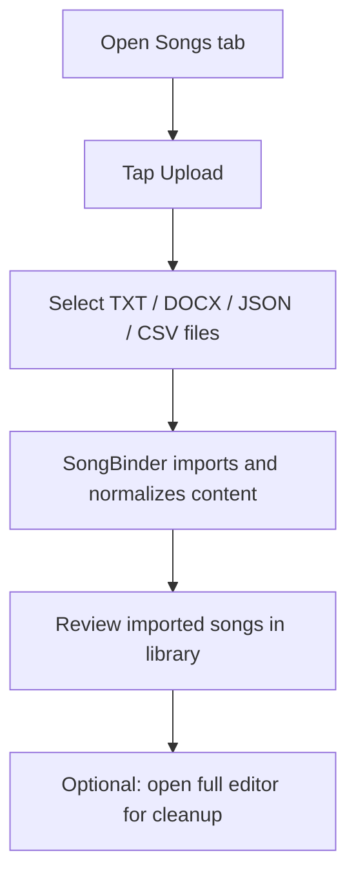
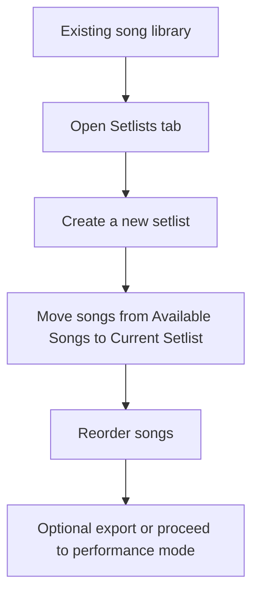
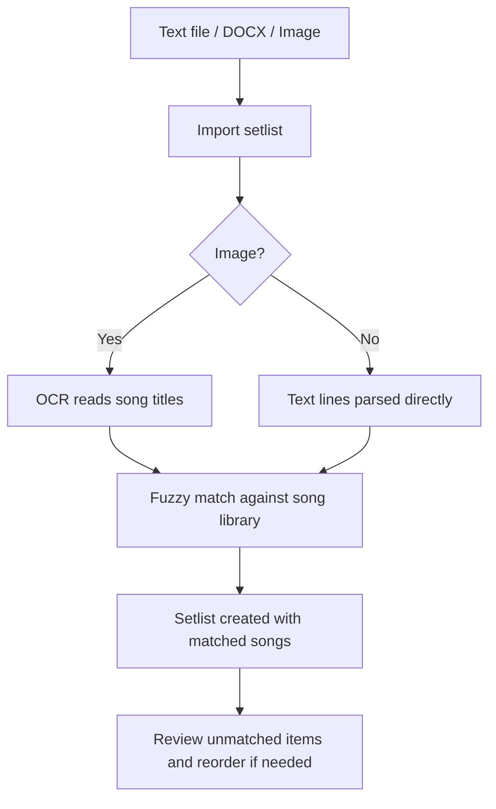
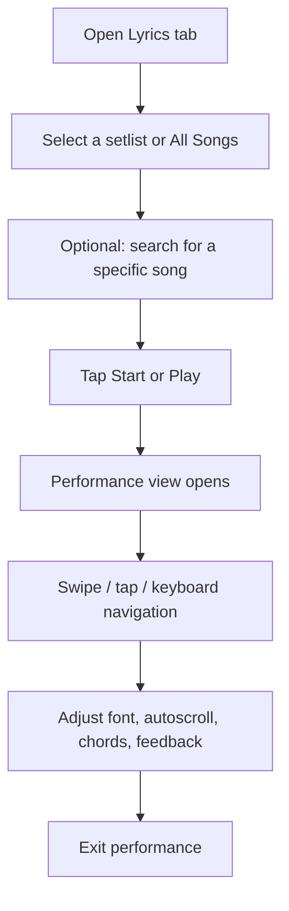

# SongBinder User Manual

## 1. Purpose of This Manual

This manual explains how to use SongBinder as an end user. It is written for musicians, worship teams, rehearsal leaders, solo performers, and setlist coordinators who need to manage songs and run live lyrics from a browser.

> **Important:** SongBinder does **not** use user accounts, cloud sign-in, or server-hosted profiles in the current implementation. Your songs and setlists are stored in the browser on the device you are using.

---

## 2. System Overview

### 2.1 What SongBinder Does

SongBinder provides four primary capabilities:

1. **Store songs locally** on your device.
2. **Build ordered setlists** from those songs.
3. **Run lyrics in performance mode** for rehearsals or live events.
4. **Edit songs in depth** with chords, metadata, and optional AI assistance.

### 2.2 What SongBinder Does Not Do

- It does not create user accounts.
- It does not sync data automatically between devices.
- It does not back up your data to the cloud.
- It does not require a server to perform its core functions.

---

## 3. Onboarding Flow

### 3.1 First Launch

When SongBinder opens for the first time:

- the application starts in **dark mode** by default,
- it requests browser storage persistence when supported,
- it may prepare offline files for later use,
- the **Songs** tab opens first.

### 3.2 Account Creation and Authentication

There is **no account creation step** and **no login step**.

Use SongBinder as follows:

1. Open the app in a supported browser.
2. Add or import songs.
3. Build a setlist.
4. Start performance mode.

### 3.3 Initial Profile Configuration

Because there is no user profile system, the practical “initial configuration” consists of:

| Setting             | Where to configure it                                 | Result                                                       |
| ------------------- | ----------------------------------------------------- | ------------------------------------------------------------ |
| Theme               | Theme toggle in main app, editor, or performance mode | Switch between dark and light appearance.                    |
| Sorting             | Songs toolbar                                         | Choose alphabetical or recently edited sorting.              |
| Favorites filter    | Songs toolbar                                         | Limit library display to favorite songs.                     |
| Backup reminders    | Export dialog                                         | Enable reminders to export backups every 7, 30, or 90 days.  |
| AI settings         | Editor → AI Tools → Settings                          | Store OpenRouter key and preferred model locally.            |
| Autoscroll defaults | Performance mode → settings                           | Set delay, scroll speed, chord visibility, and tap feedback. |

### 3.4 Recommended First-Time Setup Checklist

1. Add at least one song manually or import a small group of songs.
2. Create your first setlist.
3. Open one song in the full editor and confirm you can save changes.
4. Start performance mode once to verify that lyrics render correctly on your device.
5. Perform a full JSON export as an initial backup.

---

## 4. Main User Journeys

### 4.1 Journey A: Build a Library from Files

#### Step-by-step

1. Open the **Songs** tab.
2. Select the **Upload** button.
3. Choose one or more files.
4. Wait for the completion message.
5. Review imported titles for correctness.
6. Open any song for quick or full editing if cleanup is needed.

### 4.2 Journey B: Create a Setlist for an Event

#### Step-by-step

1. Open the **Setlists** tab.
2. Tap **New Setlist**.
3. Enter a setlist name.
4. Add songs from the **Available Songs** column.
5. Reorder songs by drag-and-drop or the arrow controls.
6. Use **Export** if you want a printed or digital backup.

### 4.3 Journey C: Import a Setlist from a Printed or Shared List

#### Best results checklist

- Ensure the songs already exist in your SongBinder library before importing the setlist.
- Use one song title per line.
- Avoid including notes, timestamps, or chord charts in the import file.
- For images, use high-contrast photos with clean text.

### 4.4 Journey D: Run a Live Performance

#### Step-by-step

1. Open the **Lyrics** tab.
2. Choose a setlist, or leave it on **All Songs**.
3. Optionally search for a specific title.
4. Tap **Start** to begin from the first song, or tap a song’s **Play** button.
5. In performance mode:
   - swipe left/right to move through songs,
   - use the font buttons to resize lyrics,
   - open settings to adjust autoscroll,
   - tap **Exit** when finished.

---

## 5. Module Breakdown

## 5.1 Songs Tab

### Purpose

The Songs tab is the master library of all songs stored on the current device/browser.

### Main controls

| Control          | Input required  | Expected output                              |
| ---------------- | --------------- | -------------------------------------------- |
| Search field     | text or voice   | Matching songs filtered by title and lyrics. |
| Sort dropdown    | sort option     | Library order updates immediately.           |
| Favorites toggle | on/off          | Shows only favorite songs when enabled.      |
| Upload           | supported files | Imports songs into local storage.            |
| Delete All       | confirmation    | Removes all songs from the library.          |
| Add Song         | title + lyrics  | Creates a new song entry.                    |

### Song item options

Selecting the menu on a song opens these actions:

| Action              | What it does                                    |
| ------------------- | ----------------------------------------------- |
| Copy Title + Lyrics | Copies the song text to the clipboard.          |
| Add/Remove Favorite | Toggles favorite status.                        |
| Quick Edit          | Opens the small modal editor.                   |
| Full Editor         | Opens the advanced editor screen.               |
| Delete              | Removes the song and updates affected setlists. |

### Input requirements

- **Title:** required.
- **Lyrics:** optional, but recommended.
- Duplicate titles are not accepted in standard quick-add flow.

### Expected outputs

- Songs appear in the library.
- New or edited songs are immediately searchable.
- Changes persist on the same device/browser.

---

## 5.2 Setlists Tab

### Purpose

The Setlists tab assembles ordered groups of songs for rehearsal or performance.

### Layout

- **Left column:** songs not yet in the current setlist.
- **Right column:** songs already assigned to the current setlist.

### Main controls

| Control           | Input required   | Expected output                             |
| ----------------- | ---------------- | ------------------------------------------- |
| Setlist selector  | existing setlist | Loads selected setlist.                     |
| New               | setlist name     | Creates a new empty setlist.                |
| Rename            | new name         | Updates selected setlist title.             |
| Duplicate         | none             | Creates a copy of selected setlist.         |
| Delete            | confirmation     | Removes selected setlist.                   |
| Import            | file             | Creates a setlist from text, docx, or JSON. |
| Import from Image | image file       | OCR creates a setlist from detected titles. |
| Export            | format choice    | Downloads the selected export file.         |

### Reordering behavior

You can reorder songs in two ways:

1. drag the grip handle, or
2. use the up/down buttons.

### Expected outputs

- The current setlist updates immediately.
- Order changes are saved automatically.
- Imported setlists become available in both Setlists and Lyrics tabs.

---

## 5.3 Lyrics Tab

### Purpose

The Lyrics tab is the launch surface for live performance mode.

### Main controls

| Control          | Input required       | Expected output                                       |
| ---------------- | -------------------- | ----------------------------------------------------- |
| Setlist selector | setlist or All Songs | Defines which songs are available to perform.         |
| Search field     | text or voice        | Filters launchable songs.                             |
| Start button     | none                 | Opens performance mode from the first available song. |
| Song Play button | none                 | Opens performance mode on that exact song.            |

### Behavior notes

- If **All Songs** is selected and no search term is entered, songs are sorted alphabetically.
- If a selected setlist was previously in progress, the app may offer to resume where you left off.

---

## 5.4 Performance Mode

### Purpose

Performance mode is optimized for reading lyrics on stage or during rehearsal.

### Main controls

| Control             | Input required | Expected output                                 |
| ------------------- | -------------- | ----------------------------------------------- |
| Font smaller/larger | tap            | Adjusts lyric font size for current song.       |
| Autoscroll button   | tap            | Starts or pauses autoscroll.                    |
| Settings button     | tap            | Opens autoscroll, chord, and feedback settings. |
| Theme toggle        | tap            | Switches light/dark mode.                       |
| Exit                | tap            | Returns to main app and saves current position. |

### Navigation methods

| Method               | Result                     |
| -------------------- | -------------------------- |
| Swipe left/right     | Move to next/previous song |
| Tap left/right zones | Move to previous/next song |
| Keyboard arrow keys  | Navigate songs             |
| Scroll manually      | Stops autoscroll           |

### Autoscroll settings

| Setting      | Meaning                                           |
| ------------ | ------------------------------------------------- |
| Delay        | How long SongBinder waits before scrolling begins |
| Speed        | Scroll speed after delay finishes                 |
| Show Chords  | Displays chord lane when available                |
| Tap Feedback | Enables no sound, click, or whoosh feedback       |

### Status indicators

- The top area shows **song title** and **position in setlist**.
- The autoscroll button changes icon when scrolling is active.
- Section labels such as `[Chorus]` render distinctly for easier navigation.

---

## 5.5 Full Editor

### Purpose

The full editor is intended for structured song writing, formatting, and metadata maintenance.

### Main modules inside the editor

| Module                | Purpose                                      | Input requirements                | Output                         |
| --------------------- | -------------------------------------------- | --------------------------------- | ------------------------------ |
| Lyrics display/editor | Edit lyric lines and sections                | text                              | Updated song body              |
| Chords mode           | Manage chord lines                           | chord text                        | Aligned chord output           |
| Metadata panel        | Key, tempo, time signature, notes, tags      | structured fields                 | Richer song metadata           |
| Copy options          | Export/copy in several formats               | button choice                     | Clipboard text or TXT download |
| AI tools              | Generate or transform song content           | prompt + optional notes + API key | Proposed AI revision           |
| Voice dictation       | Insert spoken text into selected lyric lines | microphone permission             | Dictated line content          |
| Undo/Redo             | Reverse or reapply recent edits              | none                              | Previous or later editor state |

### Metadata fields explained

| Field          | What to enter          | Example                     |
| -------------- | ---------------------- | --------------------------- |
| Key            | Musical key            | `G`, `D#m`                  |
| Tempo          | Beats per minute       | `72`, `120`                 |
| Time Signature | Meter                  | `4/4`, `6/8`                |
| Notes          | Performance notes      | `Repeat chorus twice`       |
| Tags           | Comma-separated labels | `worship, acoustic, opener` |

### AI workflow

1. Open the song in the full editor.
2. Tap **AI Tools**.
3. Choose an operation such as **Generate First Draft**, **Polish Lyrics**, **Continue Song**, or **Suggest Chords**.
4. Review the returned suggestion.
5. Accept or reject it.

> AI features require a valid OpenRouter API key entered in the editor settings.

---

## 6. Import and Export Guide

## 6.1 Importing Songs

| File type | What SongBinder expects                                     |
| --------- | ----------------------------------------------------------- |
| `.txt`    | One file = one song; title comes from filename              |
| `.docx`   | Text-based document; formatting is simplified to plain text |
| `.csv`    | Rows with `Title` and `Lyrics` columns                      |
| `.json`   | Song array or SongBinder-compatible backup format           |

### Tips

- Use clear filenames because `.txt` and `.docx` titles are inferred from filenames.
- Clean duplicate or near-duplicate titles before large imports.
- Review line breaks after importing from word-processing files.

## 6.2 Importing Setlists

| Source  | Best used for                           |
| ------- | --------------------------------------- |
| `.txt`  | Typed setlist lists                     |
| `.docx` | Shared office documents                 |
| image   | Photos or screenshots of a setlist      |
| `.json` | Previously exported SongBinder setlists |

### Important limitation

Setlist import works best when the songs already exist in the local song library. The importer uses fuzzy matching; it does not create entirely new songs from title-only text lists.

## 6.3 Exporting Data

| Export target   | Recommended use                   |
| --------------- | --------------------------------- |
| Songs JSON      | Library migration or backup       |
| Songs CSV       | Spreadsheet review                |
| Songs TXT       | Plain-text distribution           |
| Songs PDF       | Print-ready song sheets           |
| Setlist JSON    | Structured setlist backup         |
| Setlist TXT     | Quick lists for rehearsal         |
| Setlist PDF     | Printable stage packet            |
| Everything JSON | Full backup of songs and setlists |

### Backup recommendation

Use **Everything → JSON** regularly. This is the safest way to preserve your data if you clear browser storage, switch devices, or reinstall the browser.

---

## 7. Troubleshooting

## 7.1 Common Problems and Resolutions

| Problem                                     | Likely cause                                                         | Resolution                                                        |
| ------------------------------------------- | -------------------------------------------------------------------- | ----------------------------------------------------------------- |
| My songs disappeared                        | Browser storage was cleared or evicted                               | Restore from a JSON backup if available.                          |
| I cannot sign in                            | There is no sign-in system                                           | Simply use the app directly; data is local to your browser.       |
| OCR import does not find songs              | Titles in the image are unclear or the songs are not in your library | Improve image quality and verify songs exist in SongBinder first. |
| Voice features are missing                  | Your browser does not support speech recognition                     | Use a compatible browser and allow microphone access.             |
| PDF export does not open                    | Popup blocked by browser                                             | Allow popups for the site and try again.                          |
| Performance mode opens but lyrics are empty | The selected song/setlist could not be reconstructed                 | Relaunch performance mode from the main app.                      |
| AI tools do not work                        | No API key, invalid API key, or network issue                        | Re-enter OpenRouter settings and test internet connectivity.      |
| Chords look misaligned                      | Font size or spacing is not suitable                                 | Reduce/increase font size until alignment improves.               |

## 7.2 Status Messages You May See

| Message type            | Meaning                                               |
| ----------------------- | ----------------------------------------------------- |
| Success toast           | The action completed normally                         |
| Info toast              | The app is informing you of a non-fatal condition     |
| Error toast             | The requested action failed                           |
| Update available banner | A newer cached application version is ready to load   |
| Resume prompt           | SongBinder detected an unfinished performance session |

---

## 8. Frequently Asked Questions

### Q1. Can I use SongBinder on multiple devices?

Yes, but the data is not synced automatically. Each device keeps its own local data unless you export from one device and import on another.

### Q2. Do I need internet access?

Not for most day-to-day use once the app has loaded and cached successfully. Internet is only needed for optional features such as AI assistance and OCR fallback asset loading.

### Q3. Is my data uploaded anywhere?

Not by default. Songs and setlists remain in your browser unless you export them or use optional AI tools that send prompt text to OpenRouter.

### Q4. What is the safest backup method?

Use a full JSON backup from the export dialog and store the file somewhere secure.

### Q5. What happens if I delete a song that is in a setlist?

SongBinder removes the song from the library and updates any setlists that referenced it. An **Undo** action is offered immediately after deletion.

### Q6. Why does the app ask about resuming a setlist?

SongBinder stores your last performance position so you can continue where you stopped.

### Q7. Can I print songs or setlists?

Yes. Both songs and setlists can be exported to PDF for printing, depending on the chosen export scope.

---

## 9. Operational Best Practices

- Keep a full JSON backup before major edits or large imports.
- Use consistent song titles to improve fuzzy matching and OCR success.
- Test performance mode on the actual device you will use on stage.
- If you rely on AI features, verify your API key before rehearsal.
- Revisit backup reminder settings if you use SongBinder regularly.

---

## 10. Quick Reference

| Goal                          | Fastest path                    |
| ----------------------------- | ------------------------------- |
| Add one song quickly          | Songs → Add Song                |
| Import many songs             | Songs → Upload                  |
| Build a rehearsal list        | Setlists → New → Add songs      |
| Import a photographed setlist | Setlists → Import from Image    |
| Start live lyrics             | Lyrics → Select setlist → Start |
| Edit chords and metadata      | Song menu → Full Editor         |
| Create a backup               | Export → Everything → JSON      |
